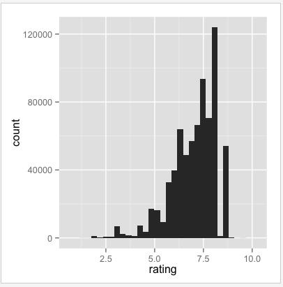
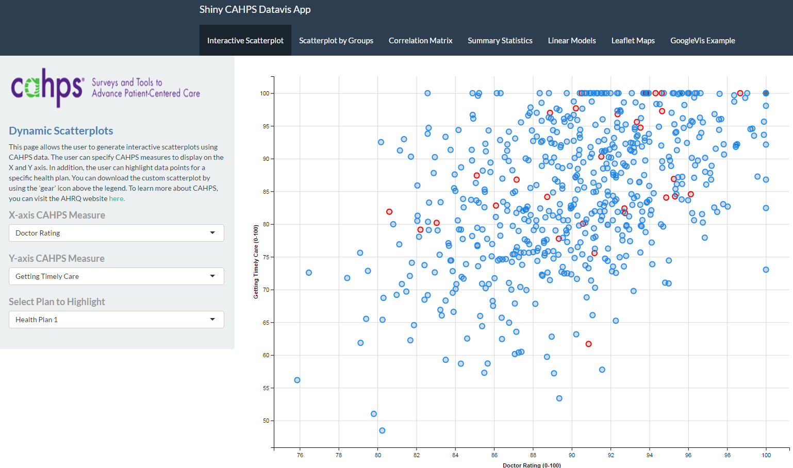

## What is R Shiny?

* In the words of its developers - "A web application framework designed for R"
* At a minimum, it allows R programmers to transform static graphs into interactive web-based visualizations

   vs.   

---

## What is R Shiny (cont.)

* In advanced settings, Shiny can be used to build complex applications which allow users to model, visualize, and input/download data

* Shiny integrates well with R's extensive visualization libraries (i.e. ggvis, leaflet, RgoogleVis) to create customizable visualizations 

 

